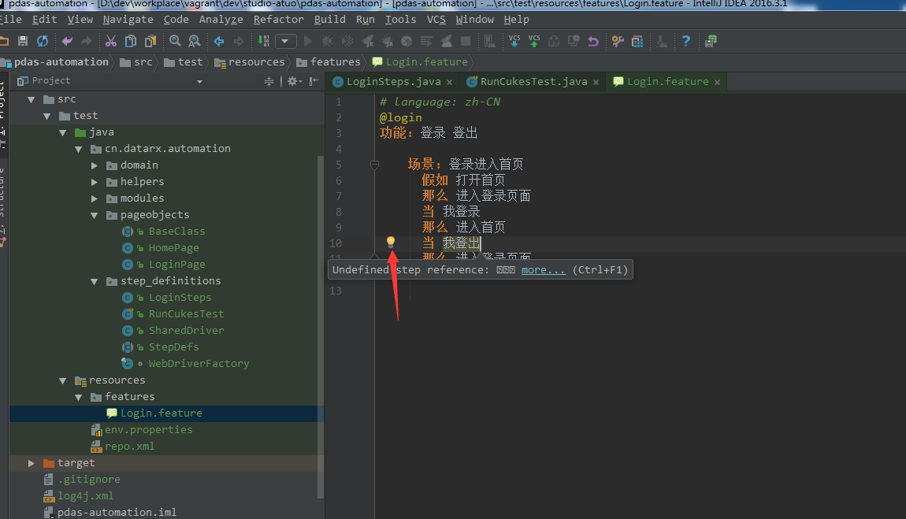
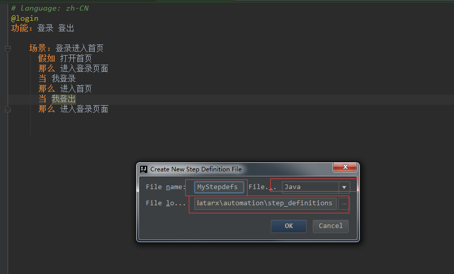
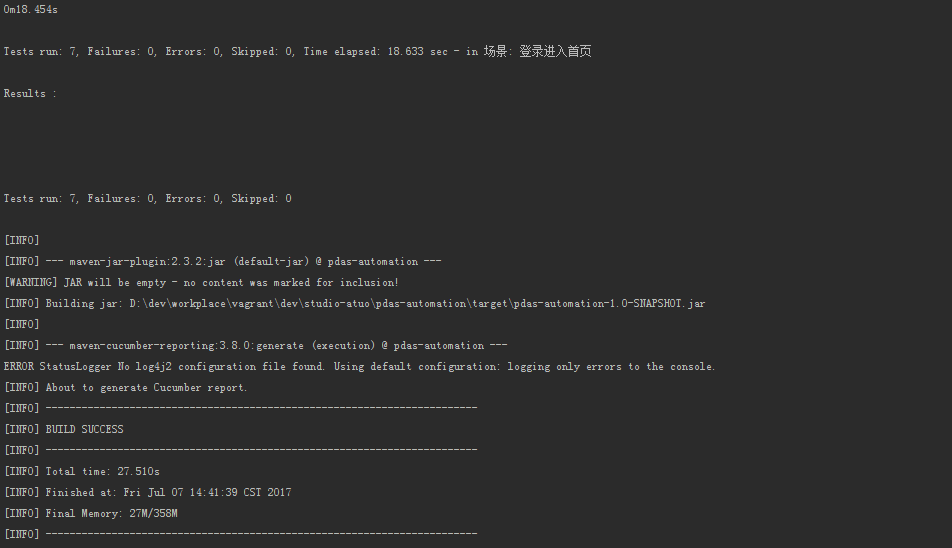
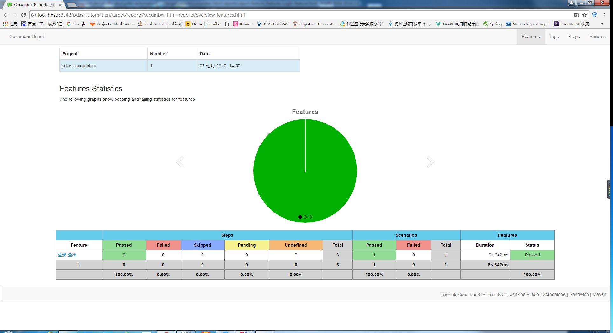
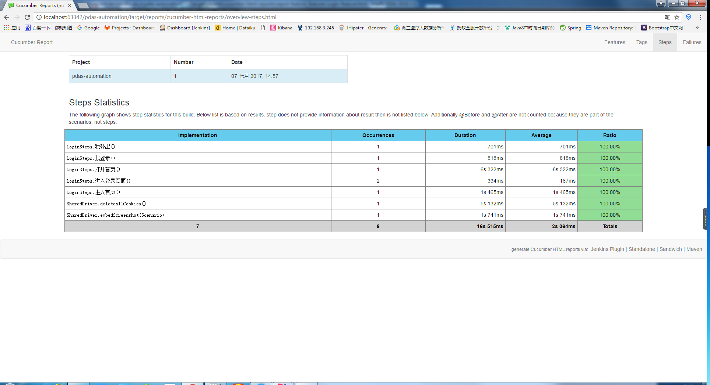
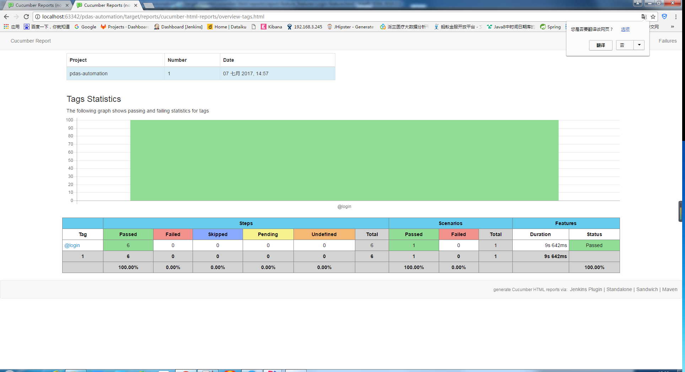
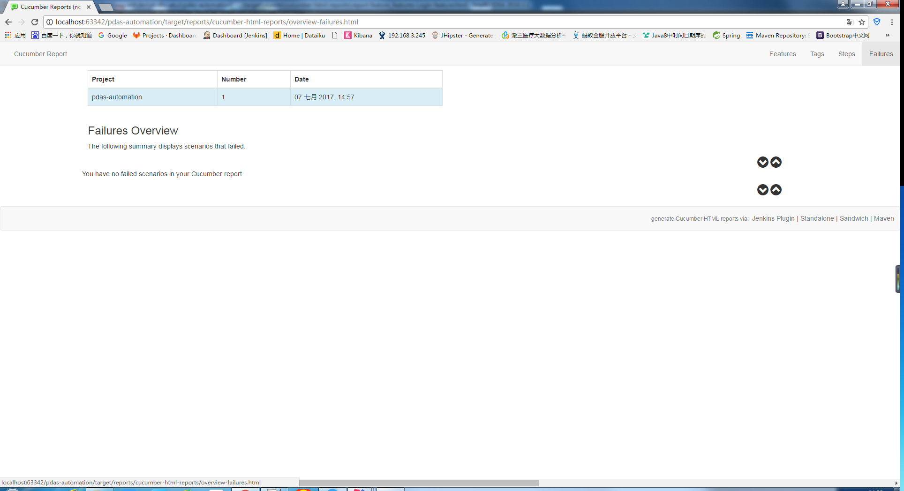

# pdas automation

## Cucumber 是什么
  
Cucumber 是 BDD 模式下实现可执行规范（Executable Specifications）的开源工具，但是它的使命并不局限于做自动化验收测试，更加重要的在于其能够在团队成员之间构建统一的交流基础（feature 文件）、规范交流用语（Domain Specific Language）、提高各个利益相关方（Business Stakeholders）沟通效率和效果，从而达到提升产品质量、做成客户期望得到的产品这一最终目标。

## 如何使用 Cucumber

Cucumber 有很多种语言的实现版本，例如 Java、Ruby、.NET、JavaScript 等等，并且 Cucumber 可以和主流的测试框架很好地集成，常见的 Selenium、SpringFramework、Ruby on Rails 等，能够方便地引入到您的测试工作中去，几乎没有任何门槛。本文以一个 Java 测试项目为例，介绍如何使用 Cucumber 的 Java 语言实现版本：Cucumber-JVM。

## doc

[cucumber-jvm](https://cucumber.io/)

[selenium](http://www.seleniumframework.com/)

## examples

[CucumberJVMExamples](https://github.com/machzqcq/CucumberJVMExamples)

[cucumber-jvm](https://github.com/cucumber/cucumber-jvm/tree/master/examples)

## Quickstart

本项目是用[maven](http://maven.apache.org/)构建的，它是一种项目构建工具，可以管理项目的依赖和插件以及打包方式，还可以根据不同的环境选择不同的配置文件

### 将 Cucumber-JVM 依赖加入到项目中

    <dependencies>
        <dependency>
            <groupId>info.cukes</groupId>
            <artifactId>cucumber-java</artifactId>
            <version>${cucumber.version}</version>
        </dependency>
        <dependency>
            <groupId>info.cukes</groupId>
            <artifactId>cucumber-java8</artifactId>
            <version>${cucumber.version}</version>
        </dependency>
        <dependency>
            <groupId>info.cukes</groupId>
            <artifactId>cucumber-testng</artifactId>
            <version>${cucumber.version}</version>
        </dependency>
        <dependency>
            <groupId>info.cukes</groupId>
            <artifactId>cucumber-junit</artifactId>
            <version>${cucumber.version}</version>
        </dependency>
        <dependency>
            <groupId>info.cukes</groupId>
            <artifactId>cucumber-picocontainer</artifactId>
            <version>${cucumber.picocontainer.version}</version>
            <scope>test</scope>
        </dependency>
    </dependencies>

关于版本，请自己选择自己适合版本。本项目使用的是 ` <cucumber.version>1.2.5</cucumber.version>`

### 编写 Executable Specification

Cucumber 之所以受到如此的推崇，与其 Executable Specification 这个特性不无关系。顾名思义，可执行规范给出了至少两个方面的意义：

*   可执行性（Executable）：您可以像执行代码（Java、Ruby...）一样运行这些规范，来验证、验收目标应用。当然，这一点是从技术人员的视角来看的；

*   规范性（Specification）：从非技术人员的视角触发，相比验证本身，他们更加关心系统功能的清晰描述：系统在什么场景下能够做什么样的事情。

这看似简单的两方面似乎关联并不是很大，但是如何能够在同一个基础（feature files）之上做到两者的融合，却是 Cucumber 最大的妙处。从项目管理人员的角度来看，Cucumber 是技术人员和非技术人员交流的桥梁，从更加深的层面来看，Cucumber 能够增加各个利益相关方的沟通，因为只有深入的沟通，在各方都理解了真正期望的功能这一基础之上，才能产出都认可的 Executable Specification！

Cucumber 是以 feature 文件来组织测试的,所以采用 feature 这个后缀。我们现在以 "打开东方融资网" 测试案例为例子，需要如下的大致步骤：

1.  创建 feature 文件；

    [Login.feature](src/test/resources/features/Login.feature)

         # language: zh-CN
         @login
         功能: 登录 登出
         
             场景: 登录进入首页
               假如 打开首页
               那么 进入登录页面
               当 我登录
               那么 进入首页
               当 我登出
               那么 进入登录页面
            
    `@login`，是tags，就是给场景定义一个标签，到时候可以根据标签来运行测试场景
       
    `# language: zh-CN` 代表 feature 文件中所使用的描述语言是中文简体，，Cucumber 本身支持超过 30 种语言（此处语言是 Spoken Language 而非 Programming Language）
                                                    
    通过`java cucumber.api.cli.Main --i18n help` 查看所支持的所有 Spoken Language；
         
         
          | feature | "功能" |
          | background | "背景" |
          | scenario | "场景", "剧本" |
          | scenario outline | "场景大纲", "剧本大纲" |
          | examples | "例子" |
          | given | "* ", "假如", "假设", "假定" |
          | when | "* ", "当" |
          | then | "* ", "那么" |
          | and | "* ", "而且", "并且", "同时" |
          | but | "* ", "但是" |
          | given (code) | "假如", "假设", "假定" |
          | when (code) | "当" |
          | then (code) | "那么" |
          | and (code) | "而且", "并且", "同时" |
          | but (code) | "但是" |
       
      
2.  生成测试 Step Definitions；

    *   在 Intellij IDEA 下生成 Steps definitions
        
        在编写 feature 文件的过程中，IDEA 会提示目前文件中哪些步骤（steps）是没有对应的 Java step definitions，如下图所示，Intellij IDEA 会以黄色的小灯泡这个提示标志来提醒作者：
        
        (1)  点击该提示图标，并从弹出的菜单项中选择“Create Step Definition”或者“Create All Steps Definition”；
   
         
        
        (2)  在弹出的“Create New Step Definition File”模式窗口中填写文件名称、实现语言以及文件位置等信息即可；
           
           

3.  运行测试用例。

    *   Run with JUnit 方式；
    
        这种方式要求必须有 JUnit Test 来触发，常规的做法是：创建一个空白的 JUnit Test，[RunCukesTest](src/test/java/com/rongzi/ms/step_definitions/RunCukesTest.java)
        
        
            package com.rongzi.ms.step_definitions;
            
            import org.junit.runner.RunWith;
            
            import cucumber.api.CucumberOptions;
            import cucumber.api.junit.Cucumber;
            
            @RunWith(Cucumber.class)
            @CucumberOptions(   
                    features = "classpath:features",
                    plugin = {
                            "pretty",
                            "html:target/pretty",
                            "json:target/cucumber.json"
                    },
                    tags = {}
            )
            public class RunCukesTest {
            
            }
        

### 运行

运行 `mvn test` 

 

生成报告 `mvn verify`, 在 *target/reports* 目录下就可以浏览生成的报告.

 

 

 

通过设置环境变量来选择测试的浏览器 `mvn clean verify -Dwebdriver=chrome`

根据tags来过滤场景 `mvn clean verify -Dwebdriver=chrome -Dcucumber.options="--tags @login"`

## 和 [jenkins](https://jenkins.io/)集成

1.  创建jenkins job
2.  设置启动测试脚本的条件，比如开发部署完新版本的应用后开始启动自动化测试的jenkins任务
3.  jenkins 可以设置多台服务器同时跑自动化测试任务，比如总共有 100个测试案例，设置server1跑 1～50 的测试场景，设置server2 跑 51～100 的 测试场景，这样的话本来如果一台服务器跑1小时跑完所有场景的话，那么现在就是两台一起跑，那跑完所有测试只需要半小时了。
    